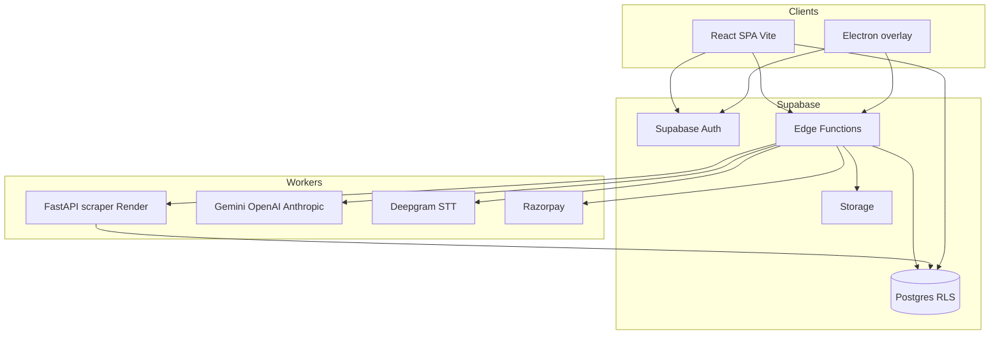
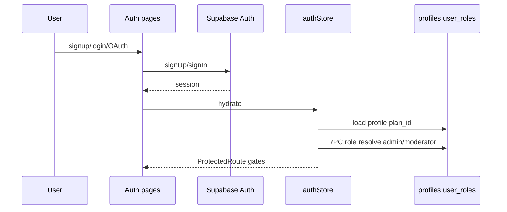
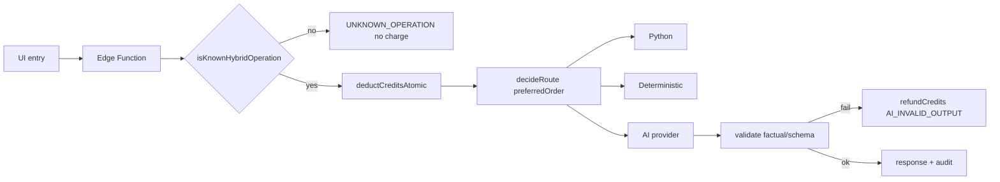
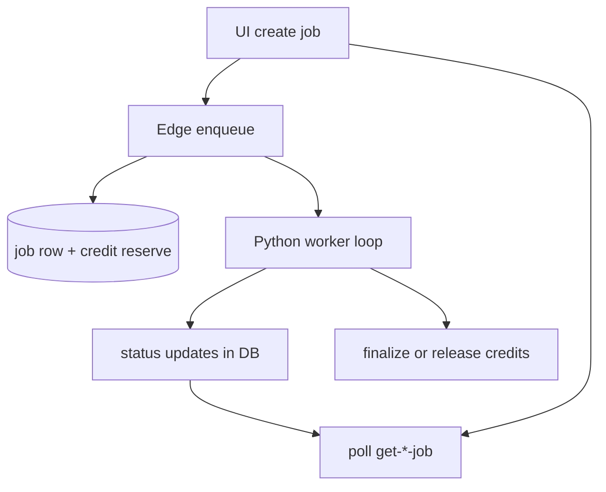
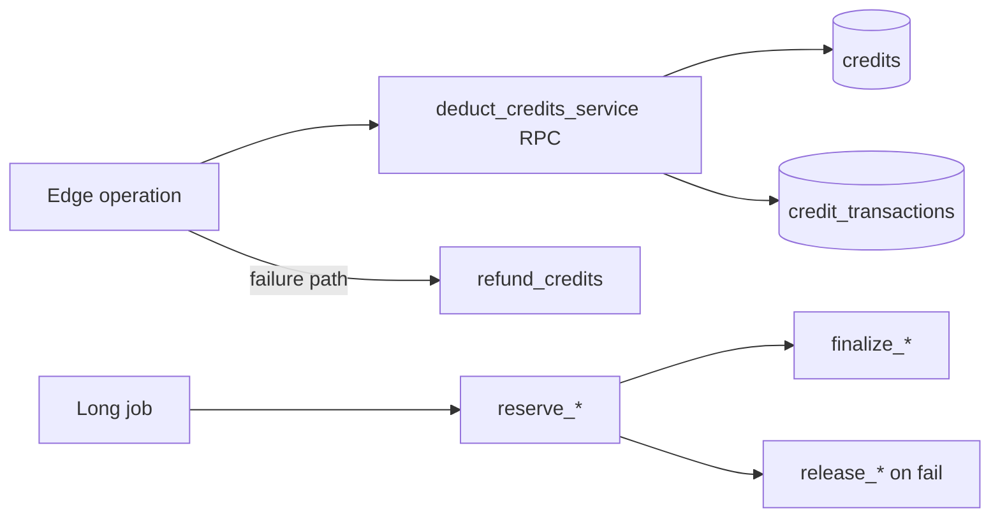
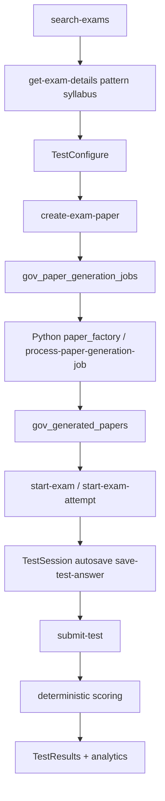

# Career Pilot — Current Implementation Audit

**Document type:** Evidence-based repository inspection (documentation only)  
**Generated from:** Source code, migrations, Edge Functions, Python services, tests, and deployment configs  
**Scope:** Document what exists — not a proposed architecture, not a fix list  
**Repo path:** `clarity-assistant` (npm package name `clarify-ai`)  
**User-facing brand:** Career Pilot (`src/lib/constants/productNames.ts`, `index.html`, electron-builder `productName`)

**Status vocabulary used throughout:**

| Label | Meaning |
|-------|---------|
| Implemented and connected | UI + backend + DB path wired in production sources |
| Implemented with defects | Path exists; known code-level gaps or honesty limitations |
| Partially implemented | Core path works; adjacent features incomplete or gated |
| UI only | Frontend present without durable backend |
| Backend only | Edge/DB/Python without matching product UI |
| Configuration dependent | Code present; live behavior needs secrets/env/host |
| Test or mock only | Fixtures/contracts without proving production readiness |
| Deprecated | Explicitly retired redirects or stubs |
| Missing | No production implementation found |
| Unclear | Insufficient repository evidence |

---

## 1. Repository discovery

### 1.1 Present major locations

| Location | Evidence of role |
|----------|------------------|
| `src/` | Canonical React SPA (pages, hooks, stores, lib, components) |
| `public/` | Static assets, brand icons, sitemap |
| `supabase/config.toml` | Supabase project config (`project_id` present) |
| `supabase/migrations/` | **232** SQL migrations |
| `supabase/functions/` | ~99 Edge Function folders + `_shared/` |
| `scraper/` | Python FastAPI (gov exams, paper factory, document intelligence) |
| `electron/` | Desktop overlay shell (`main.cjs`, `preload.cjs`, `menu.cjs`, `window-state.cjs`) |
| `e2e/` | Playwright specs (~57 `*.spec.ts`) |
| `src/test/` | Vitest unit/contract tests |
| `docs/` | Domain documentation + audit notes |
| `scripts/` | Deploy, QA, billing parity, env, SEO, mail, Electron helpers |
| `shared/` | Cross-runtime data (e.g. algorithm catalog JSON) |
| `.github/workflows/` | CI, Electron release, daily exam scrape, SEO |
| `render.yaml` | Render Docker deploy for Python scraper |
| `.env.example`, `.env.production.example`, `.env.qa.example`, `scraper/.env.example` | Env templates |

### 1.2 Non-canonical / legacy / tooling (not primary runtime)

| Location | Status |
|----------|--------|
| `feature-copies/` | Frozen/snapshot copies of feature slices — **not** live app source of truth |
| `feature-copies/rooms-legacy/` | Legacy rooms feature |
| `node_modules_mcp/`, `tmp-mcp-runner/` | MCP tooling residue |
| `dist/`, `release/`, `release-new/` | Build/installer outputs |
| `playwright-report/`, `test-results/`, `_qa_*`, QA workbooks | Audit/QA artifacts |
| `supabase/functions/parakeet-token/` | Folder exists; **no `index.ts`** (orphan vs live functions) |
| `.lovable/` | Lovable platform metadata |

### 1.3 Missing hosting configs

- No `vercel.json` / `netlify.toml` in repository  
- No root `Dockerfile` for the web app (Docker exists under `scraper/` only)  
- Web hosting inferred as Lovable/custom + domain `trycareerpilot.com` (CI/SEO scripts); **live host requires environment verification**

---

## 2. Executive application summary

**Official product name:** Career Pilot  
**Package/repo legacy names:** `clarify-ai` / `clarity-assistant` / appId `com.clarify.coach`  
**Purpose:** AI-powered career interview practice and India government exam preparation  
**Intended users:** Job seekers practicing interviews (Practice Coach / Mock); India-region users for gov exams; staff admins/moderators; optional Learning/Community consumers  

### Main user journeys (implemented)

1. Sign up → verify email → onboard → dashboard  
2. Practice Coach (Live Copilot): setup → capture audio → hints/answers → end → scorecard/debrief  
3. Mock Interview: setup → TTS questions → answers → scorecard/debrief  
4. Gov Exams (India): search → configure → generate paper job → attempt → score → results  
5. Prep Lab tools (STAR, rephrase, system design, project builder, coding hints)  
6. Documents (resume/JD parse, gap analysis) → Answer Bank → Session History / Analytics  
7. Billing: Razorpay checkout + credit packs; credits deducted via Edge/RPC  
8. Admin: users, finance, gov paper factory, CMS, support chat  

### Technology (actual)

| Layer | Technology | Evidence |
|-------|------------|----------|
| Frontend | React 18 + Vite + TypeScript | `package.json`, `vite.config.ts` |
| Routing | react-router-dom 7 (`createBrowserRouter` / Electron hash) | `src/App.tsx` |
| State | Zustand + TanStack Query | `src/store/*`, `@tanstack/react-query` |
| UI | Tailwind 3 + shadcn/Radix | `tailwind.config.ts`, `components.json` |
| Backend | Supabase Edge Functions (Deno) | `supabase/functions/*/index.ts` |
| Database | Postgres via Supabase | migrations + `types.ts` |
| Auth | Supabase Auth | `src/lib/supabase/auth.ts`, `authStore.ts` |
| AI | Gemini/OpenAI/Anthropic via Edge shared providers + hybrid Python | `_shared/aiProvider.ts`, `hybridExecute.ts` |
| Python | FastAPI on Render | `scraper/app/main.py`, `render.yaml` |
| Desktop | Electron 32 overlay-only | `electron/`, `electronRoutes.ts` |
| Billing | Razorpay primary; Stripe Edge stubs also present | `razorpay-*`, `stripe-webhook` |
| Credits | Catalog `credit_catalog_v3` + RPC `deduct_credits_service` | `creditEconomics.ts`, migrations |

### Maturity snapshot

| Area | Status |
|------|--------|
| Interview practice (live + mock) | Implemented and connected |
| Gov exam generation/attempt | Implemented and connected (India-gated; config-dependent workers) |
| Hybrid AI + fail-closed registry | Implemented and connected (post-foundation pass) |
| Credit economy | Implemented and connected (parity scripts exist; live Razorpay config-dependent) |
| Desktop | Partially implemented (Practice Coach overlay only) |
| Learning Hub | Partially implemented (empty/preview when no published courses) |
| Vector RAG / embeddings | Missing (`embeddings_enabled: false` in algorithm catalog) |
| Full GO_PRODUCTION certification every module | Missing / deferred (see `docs/audit/AI_PLATFORM_FOUNDATION.md`) |

---

## 3. Repository structure

### 3.1 Directory-by-directory

#### `src/`

| Subtree | Purpose | Used? |
|---------|---------|-------|
| `pages/marketing/` | Public marketing | Yes — `/`, `/pricing`, etc. |
| `pages/auth/` | Login/signup/MFA | Yes |
| `pages/onboarding/` | Onboarding wizard | Yes |
| `pages/app/` | Product app (live, mock, gov, prep, settings, admin) | Yes — primary |
| `components/` | UI + layout + overlay | Yes |
| `hooks/` | Session/audio/billing hooks | Yes (`useLiveCopilot`, etc.) |
| `store/` | Zustand stores | Yes |
| `lib/` | Domain logic (ai, billing, gov-exam, session, mock) | Yes |
| `integrations/supabase/` | Generated types + client | Yes |
| `test/` | Vitest | Yes |

**Routes:** All app routes declared in `src/App.tsx`.  
**Backend:** Calls Edge via `fetchEdge` / `fetchEdgeJson` (`src/lib/network/fetchEdge.ts`).  
**DB:** Direct Supabase client reads for RLS-owned tables; mutations often via Edge/RPC.

#### `supabase/`

| Subtree | Purpose |
|---------|---------|
| `migrations/` | Schema, RLS, RPCs (232 files) |
| `functions/` | Edge HTTP handlers + `_shared` hybrid/credit/AI utilities |
| `config.toml` | Local/remote project config |

#### `scraper/`

| Subtree | Purpose |
|---------|---------|
| `app/main.py` | FastAPI entry; mounts health, scrape, gov_exams, paper_factory, document_intelligence, operations, process |
| `app/hybrid/` | Supported hybrid operations |
| `app/core/internal_auth.py` | HMAC service-to-service auth |
| `tests/` | pytest suite (~31 files) |

**Related Edge:** `hybrid-ping`, `hybrid-health`, `process-paper-generation-job`, document job functions, gov assemble paths.

#### `electron/`

Overlay Practice Coach shell only. Non-allowed paths open in browser (`src/lib/platform/electronRoutes.ts`).

#### `e2e/` + `src/test/`

Playwright product flows; Vitest contracts for Edge source, billing, session, gov, AI.

#### `feature-copies/`

**Parallel source of truth risk.** Live product must use `src/` + `supabase/functions/` — not `feature-copies/`.

#### `docs/`

Operational and domain reports (gov-exam, referrals, results, assessments, qa). Not runtime.

### 3.2 Highlights: duplication and naming

| Issue | Evidence |
|-------|----------|
| Brand vs package naming | Career Pilot UI vs `clarify-ai` package / Clarify GitHub org |
| Dual plan display | `plan_id` `enterprise` displays as **Max** (`planCatalog.ts`) |
| Edge HybridOperation vs Python op names | Not 1:1; mapped in clients |
| Stripe + Razorpay both in repo | Razorpay is live checkout path; Stripe functions remain |
| `types.ts` lag | Some Sep 2026 tables in migrations not yet in generated types |
| Storage namespace migration | New `career-pilot:` keys with Clarify read-compat |

---

## 4. Technology stack

| Concern | Technology | Proving files |
|---------|------------|---------------|
| Languages | TypeScript, SQL, Python, CJS (Electron) | `src/`, `supabase/`, `scraper/`, `electron/` |
| Frontend | React 18.3 | `package.json` |
| Bundler | Vite + `@vitejs/plugin-react-swc` | `vite.config.ts` |
| Routing | react-router-dom 7 | `src/App.tsx` |
| Styling | Tailwind 3.4 + CSS variables | `tailwind.config.ts`, `src/index.css` |
| Components | Radix + shadcn + lucide + sonner | `components.json`, `src/components/ui/` |
| Forms | react-hook-form + zod | `package.json`, validators under `src/lib/validators/` |
| Client state | Zustand | `src/store/authStore.ts`, `overlayStore.ts`, … |
| Server cache | TanStack Query | `package.json`, hooks |
| Auth | Supabase Auth | `src/lib/supabase/auth.ts` |
| DB | Postgres (Supabase) | `supabase/migrations/` |
| Storage | Supabase Storage (documents) | document processing Edge + migrations |
| Edge | Deno Edge Functions | `supabase/functions/` |
| Python | FastAPI + uvicorn | `scraper/app/main.py`, `render.yaml` |
| AI | Gemini primary; OpenAI/Anthropic fallbacks | `_shared/aiProvider.ts`, `resolveModel.ts` |
| Embeddings/RAG | Off | `algorithmCatalog` `embeddings_enabled: false` |
| STT | Deepgram (token Edge) | `deepgram-token`, `src/lib/audio/deepgramToken.ts` |
| TTS | Browser `speechSynthesis` (+ optional server TTS stub) | `src/lib/mock/mockTts.ts`, `serverTts.ts` |
| OCR/docs | Python document intelligence + Edge parse | `parse-document`, `parse-resume`, scraper DI |
| Coding sandbox | Client/JS runner + Edge `score-coding-submission` | `javascriptSolveRunner.ts`, Coding Lab pages |
| Payments | Razorpay (+ Stripe stubs) | `razorpay-*`, `create-checkout` |
| Email | Hostinger mail + `send-email` | `hostinger-mail`, scripts |
| Calendar | Google Calendar OAuth | `sync-calendar`, `googleCalendar.ts` |
| Analytics | PostHog client + Sentry | `package.json`, Vite Sentry plugin |
| Testing | Vitest, Playwright, pytest | configs + suites |
| Desktop | Electron 32 + electron-builder | `package.json` `build`, `electron/` |
| Hosting | Render (Python); web host not declared in-repo | `render.yaml` |

---

## 5. Current architecture

### 5.1 High-level system architecture



### 5.2 Request flow (typical AI feature)

1. UI builds context (often frozen snapshot for Practice Coach)  
2. `fetchEdgeJson` / SSE to Edge Function with JWT + idempotency key  
3. Edge: auth, rate limit, capability, session enforcement  
4. `executeHybridOperation` / `prepareHybridStreamOperation`: known-op check → credit reserve → route (DB / deterministic / Python / AI)  
5. Validate output (e.g. factual integrity for live hint/answer)  
6. Persist artifacts / return SSE or JSON  
7. UI updates stores; Session History / scorecard may enqueue later  

### 5.3 Responsibilities

| Layer | Responsibilities |
|-------|------------------|
| Client | UX, mic/system audio, overlay, local freeze of Practice Coach context, optimistic UI, credit UX |
| Edge | AuthZ, credits, hybrid orchestration, AI prompts, webhooks, gov attempt APIs |
| Python | Paper factory, document intelligence, hybrid ops, scraping |
| Database | Ownership via RLS, ledgers, jobs, session artifacts |
| Desktop | Limited route shell + overlay window; same web backends |

### 5.4 Authentication flow



### 5.5 AI operation flow



### 5.6 Long-running job flow (gov paper / document)



### 5.7 Credit charging flow



### 5.8 Desktop Live Copilot flow

```mermaid
flowchart TB
  Install[Electron app] --> Gate[ElectronRouteGate]
  Gate -->|allowed| Live[/app/live or overlay]
  Gate -->|else| Browser[open in system browser]
  Live --> Hook[useLiveCopilot]
  Hook --> Start[start-session Edge]
  Hook --> Freeze[practiceCoachContext snapshot]
  Hook --> STT[Deepgram via deepgram-token]
  Hook --> Hint[generate-hint / generate-answer]
```

### 5.9 Government Exam flow



### 5.10 Observability

- Edge audit helpers (`_shared/audit.ts`)  
- Sentry frontend plugin  
- PostHog  
- Python `/health` `/ready` + metrics router  
- Hybrid health Edge functions  

---

## 6. Complete route and navigation inventory

**Router SSOT:** `src/App.tsx` (BrowserRouter web; HashRouter Electron).

### 6.1 Gate mechanisms

| Gate | File | Effect |
|------|------|--------|
| `ProtectedRoute` | `components/layout/ProtectedRoute.tsx` | Auth + optional onboarded/email/staff |
| `FeatureKillGate` / `PlanGate` | `PlanGate.tsx` | Capability/feature flags |
| `IndiaRegionGate` / `IndiaAppPage` | India UI gate for gov exams | Soft unavailable for non-India (current code path) |
| `ElectronRouteGate` | Desktop allowlist | Non-live routes → browser |

### 6.2 Public / marketing

`/`, `/pricing`, `/gov-exams`, `/help`, `/help/:slug`, `/shortcuts`, `/download`, `/blog`, `/blog/:slug`, `/terms`, `/privacy`, `/cookies`, `/careers`, `/contact-sales`, `/about`, `/industries`, `/faq`, `/share/:token`, `/verify-certificate`, `/verify-certificate/:certificateId`  
Redirect: `/dashboard` → `/app/dashboard`

### 6.3 Auth / onboarding

`/login`, `/signup`, `/verify-email`, `/forgot-password`, `/reset-password`, `/auth/callback`, `/auth/mfa-enroll`, `/auth/mfa-recovery`  
`/onboarding` (+ step redirects → `/onboarding`)

### 6.4 App shell (protected + AppSidebar)

| Path | Module | Notes |
|------|--------|-------|
| `/app/dashboard` | Dashboard | |
| `/app/live`, `/app/live/overlay` | Practice Coach | Flag `overlay`; overlay fullscreen |
| `/app/mock`, `/warmup`, `/session/:sessionId` | Mock | Flag `mock_sessions` |
| `/app/mock-test/*` | Gov Exams | India-gated |
| `/app/assessments/*` | Assessments | Worldwide |
| `/app/prep/*` | Prep Lab | |
| `/app/sessions`, `/sessions/:id` | Session History | |
| `/app/documents/*`, `/app/library` | Documents | |
| `/app/answers/*` | Answer Bank | Flag `answer_bank` |
| `/app/interviews/*`, `/interview-day` | Scheduler | Flag `calendar_sync` |
| `/app/companies/*` | Company Research | Flag `company_research` |
| `/app/scorecard/:sessionId`, `/debriefs/*` | Results | |
| `/app/analytics`, `/app/usage` | Analytics / credits usage | Flag `analytics` |
| `/app/referrals` | Referrals | |
| `/app/plan`, `/question-bank`, `/practice-workspace` | Practice aids | |
| `/app/learn/*`, `/community/*`, `/coding/*` | Learn / community / coding | Coding flag `coding_hints` |
| `/app/settings/*` | Settings | |
| `/app/guide/*` | In-app guides | |
| `/app/rooms*` | Deprecated redirect | |
| `/app/admin/*` | Admin | `requireStaff` |

### 6.5 Navigation surfaces

- **Sidebar:** `AppSidebar.tsx` `NAV_SECTIONS` + `PRODUCT_NAMES`  
- **Mobile:** `MobileNav.tsx`  
- **Command palette:** `CommandPalette.tsx`  
- **Admin:** `AdminLayout.tsx`  
- **Marketing:** `MarketingLayout.tsx`  

**Discoverability gaps:** Some settings/admin/gov admin routes are staff-only or nested; Practice workspace / library are in sidebar Progress section.

---

## 7. User roles, plans, and permissions

### 7.1 Plans (`plan_id`)

Canonical IDs: `free`, `starter`, `pro`, `elite`, `enterprise`  
Display: Free / Pro / Pro / Pro / **Max** (`src/lib/billing/planCatalog.ts`)  
Stored on `profiles.plan_id` (authStore loads DB-derived — not localStorage).

### 7.2 Roles

| Role | Storage | Resolution |
|------|---------|------------|
| User | session + profile | Default |
| Admin | `user_roles` via RPC | `authStore` `resolveAdminRole` — fail closed non-admin |
| Moderator | `user_roles` | `isModerator` |
| Staff routes | `requireStaff` | Admin layout |

**Explicit:** Admin flags are **not** taken from `profiles.is_admin` (comment in authStore).

### 7.3 Account states (code-handled)

- Unverified email → onboarding/email gates  
- Onboarding incomplete → `/onboarding`  
- Banned → ban checks in Edge (`banCheck.ts`) + auth messaging  
- Subscription status on profile (`subscriptionManager.ts`)  
- India vs non-India for gov UI  

### 7.4 Capabilities / feature kills

`FeatureKillGate` keys observed: `overlay`, `mock_sessions`, `analytics`, `answer_bank`, `calendar_sync`, `company_research`, `coding_hints`  
Edge: `requireCapability` / `requireCapabilityForFunction`  
Product engines: interview vs gov_exam (`productEntitlements.ts`)

### 7.5 Permission inconsistency risks

- Frontend kill switches vs Edge capability checks can drift (mitigated by release capability gate scripts)  
- Soft `SAFE_DEFAULT_POLICY` remains for **unnamed AI features** in `aiFeaturePolicy.ts` (distinct from hybrid route fail-closed)  
- Plan display aliases (`starter`/`pro`/`elite` all show “Pro”) can confuse billing UX

---

## 8. Authentication and onboarding

| Flow | UI | Backend | Notes |
|------|----|---------|-------|
| Signup | `Signup.tsx` | Supabase Auth | |
| Email verification | `VerifyEmail.tsx` | Supabase | Gated by ProtectedRoute |
| Login | `Login.tsx` | Auth | |
| OAuth | AuthCallback | Supabase providers | `VITE_OAUTH_PROVIDERS` |
| Password reset | ResetPassword | Auth | |
| MFA enroll/recovery | MfaEnroll / MfaRecovery + Edge `mfa-recovery` | Present |
| Session restore | authStore hydrate | Tab-aware storage | JWT not persisted in zustand persist |
| Cross-tab | storage events / focus recovery | Present in auth + focus recovery libs |
| Logout | authStore | Clears stores | |
| Ban/suspend | Edge + auth messaging | Present |
| Profile create | post-auth profile row | migrations/triggers + load |
| Onboarding | `OnboardingIndex` steps | Profile flags | Resume parse can run during onboarding |

Protected routes: `requireOnboarded` + `requireEmailVerification` for `/app/*`.

---

## 9. Module-by-module current implementation

Status is evidence-weighted. Credit keys from `creditEconomics.ts` / Edge mirror.

### 9.1 Public pages — Implemented and connected

Marketing pages + SEO scripts (`scripts/generate-sitemap.mjs`). No credits.

### 9.2 Authentication — Implemented and connected

See §8. Tests: `e2e/login.spec.ts`, `auth-*.spec.ts`, signup-flow.

### 9.3 Onboarding — Implemented and connected

Routes `/onboarding*`. May call parse-resume with onboarding header.

### 9.4 Dashboard — Implemented and connected

`Dashboard.tsx`; setup checklist; nav polish e2e.

### 9.5 Live Copilot / Practice Coach — Implemented and connected

| Item | Evidence |
|------|----------|
| Routes | `/app/live`, `/app/live/overlay` |
| Hook | `useLiveCopilot.ts` |
| Context freeze | `practiceCoachContext.ts` + store |
| Edge | `start-session`, `generate-hint`, `generate-answer`, `ai-coach-chat`, `deepgram-token`, `finalize-session` |
| Credits | `live_hint`, `live_answer`, `screenshot_answer`, `ai_coach_message` |
| Factual gate | `assertLiveCoachOutputGrounded` post-generation |
| Tests | practice-coach e2e + liveCoach factual contracts |

**Gaps:** Desktop-only system audio nuances; STT config-dependent; PCM re-transcribe deferred in docs.

### 9.6 Mock Interview — Implemented and connected

Immutable `interviewContext.ts` snapshot; blueprint; TTS via `mockTts.ts` (browser speechSynthesis); Edge generate-questions/hint/answer/scorecard; credits include `mock_session` / `generate_questions`.

### 9.7 Government Exams — Implemented and connected (India UI)

Full job pipeline + attempt FSM; Edge suite (`create-exam-paper`, `process-paper-generation-job`, `start-exam`, `submit-test`, …); Python paper_factory; credits `create_mock_test` / gap fill keys; RLS freeze migrations.

**Blockers (code-visible):** India gate; worker/Python URL secrets; bank inventory sufficiency errors; embeddings off.

### 9.8 Assessments — Implemented and connected

`assemble-assessment`, personalization migrations (`assessment_context_snapshots`, blueprints); session reuses TestSession patterns; worldwide (not India-only).

**Gap:** Generated `types.ts` may lag personalization tables.

### 9.9 Coding Assessments / Coding Lab — Implemented and connected (flagged)

`/app/coding*`; `score-coding-submission`; FeatureKillGate `coding_hints`.

### 9.10 AI chatbot (support + coach)

| Chat | Status |
|------|--------|
| Support widget | Implemented — `support-chat` Edge |
| Practice AI coach chat | Implemented — `ai-coach-chat` + policy |

### 9.11 Prep Lab — Implemented and connected

STAR / rephraser / system design / project builder / coding hints → primarily `prep-tool` Edge; STAR also `generate-star-answer` / `polish-star-section`. Credits: `star_builder`, `rephraser`, `system_design`, `project_builder`, `coding_hint`, `polish_star`.

### 9.12 Company Research — Implemented and connected

Async job + Edge `company-research`; credit `company_research`; reserve/finalize pattern.

### 9.13 Resume / JD / Gap Analysis / Documents / OCR — Implemented and connected

`parse-resume`, `gap-analysis`, document processing jobs + Python DI; credits `resume_analysis`, `gap_analysis`, `parse_document`.

### 9.14 Cover Letter — Partially implemented

Loaded into Practice Coach context (`loadPrimaryCoverLetterText`); not a full standalone product module in nav.

### 9.15 Answer Bank — Implemented and connected

CRUD + AI via prep-tool; used as frozen IDs in Practice Coach snapshot.

### 9.16 Scheduler / Integrations / Interview Day — Implemented and connected

`schedule-interview`, `sync-calendar`, `disconnect-calendar`; Google OAuth config-dependent.

### 9.17 Session History — Implemented and connected

RPC `get_session_history` (migration `20260904120000_get_session_history.sql`); `CallSessions.tsx` / `SessionDetail.tsx`.

### 9.18 Scorecards — Implemented and connected (honesty pass)

`generate-scorecard`; evaluation_status migration; eligibility codes; **no fake zero metrics** when missing (prior pass).

### 9.19 Debriefs — Implemented and connected

`generate-debrief`, `list-session-debriefs`; share token public route.

### 9.20 Reports / Analytics — Implemented and connected

`analytics-dashboard`, `compare-sessions`; FeatureKillGate `analytics`.

### 9.21 Referrals — Implemented and connected

`record-referral`, `validate-referral-code`; programme lifecycle migration `20260904150000_*` (types lag risk).

### 9.22 Billing / Credits — Implemented and connected (config-dependent live pay)

Razorpay order/verify/webhook; catalog `billing-catalog`; `deduct-credits`; atomic RPC. Stripe functions present (portal/checkout/webhook) — dual-rail; README may understate Razorpay.

### 9.23 Notifications — Partially implemented

In-app notifications page + settings channels; delivery wiring varies by channel.

### 9.24 Settings — Implemented and connected

Profile, audio, practice-coach, models, billing, privacy, security, integrations, data export, danger delete-account, hotkeys, polish.

### 9.25 Learning — Partially implemented

Courses/enrollments; empty state “Preview”; `issue-course-certificate`.

### 9.26 Community — Implemented and connected

Posts + `moderate-content`; admin community page.

### 9.27 Admin Portal — Implemented and connected

Finance, AI hub, feature flags, gov paper factory, CMS, support, mail, diagnostics — staff only.

### 9.28 Desktop application — Partially implemented

Overlay Practice Coach only (`electronRoutes.ts`); installer via electron-builder / GitHub Releases workflow.

### 9.29 Practice Workspace / Question Bank / Library / Plan — Implemented and connected

Mostly client + DB; practice workspace local scoring noted without dedicated Edge.

---

## 10. Live Copilot and desktop application

| Capability | Status | Evidence |
|------------|--------|----------|
| Web Practice Coach | Implemented | `/app/live`, `useLiveCopilot` |
| Electron shell | Partial | Auth + live/overlay only |
| Installer/updates | Config-dependent | electron-builder + `electron-release.yml` |
| Auth handoff | Connected | Same Supabase session |
| Microphone | Connected | audio hooks / precheck |
| System audio | Partial / desktop-leaning | `useSystemAudio` + Electron APIs |
| STT | Config-dependent | Deepgram token Edge |
| TTS | N/A for live hints (mock uses TTS) | Live is assistive overlay |
| Auto Assist / Manual AI Help | Connected | Question detection + confirm UI |
| Typed fallback | Connected | Manual question submit |
| Overlay | Connected | `LiveOverlay`, stealth root id |
| Pause/resume / reconnect | Partial | Session restore + checkpoints |
| Frozen AI context | Connected | Practice coach snapshot |
| Screen-share honesty | Implemented with defects | ScreenCaptureBlocker copy |
| Scorecard/Debrief/Analytics | Connected post-session | Same as web |
| Credits | Connected | hint/answer/chat keys |

---

## 11. Mock Interview

| Topic | Status |
|-------|--------|
| Setup inputs | Implemented — LiveSessionConfig fields |
| Resume/JD freeze | Implemented — `InterviewContextSnapshot` |
| Blueprint / dynamic questions | Implemented — `interviewBlueprint`, `generate-questions` |
| Follow-ups | Implemented — follow_up_depth |
| Silence / next question | Implemented in session FSM |
| TTS | Browser speechSynthesis (`mockTts.ts`); server TTS optional/secondary |
| STT | Shared audio pipeline |
| Duplicate prevention | Fingerprints / progress notes |
| Persistence | `sessions.notes` mock progress JSON |
| Scorecard/Debrief/Analytics/Credits | Connected |

---

## 12. Government Exams

End-to-end path matches §5.9 diagram. Key code: `src/lib/gov-exam/*`, `src/pages/app/mock-test/*`, Edge gov functions, `scraper` paper_factory, migrations `gov_*`.

| Topic | Status |
|-------|--------|
| Registry / aliases / stages / patterns / syllabi | Implemented (DB + Edge get-*) |
| Realistic mock generation | Implemented (job + worker) |
| OCR/ingest | Implemented (admin ingest + Python) |
| Validation / dedupe | Implemented (validators, questionStemDedupe) |
| Credits reserve/release fail-closed | Implemented (migrations 2026090223*) |
| Attempt ownership / timer / autosave | Implemented |
| Deterministic scoring | Implemented (`mockTestScoring` / submit-test) |
| Embeddings similarity | Missing/off |
| India UI gate | Connected |
| Live blockers | Config: Python URL, secrets, bank inventory |

---

## 13. AI architecture

### 13.1 Hybrid operations (registry — authoritative)

From `operationRouter.ts` / `aiOperationRegistry.ts` (18 ops):  
`gov_exam_assemble`, `resume_parse`, `document_process`, `star_builder`, `system_design`, `practice_coach_help`, `live_answer`, `company_research`, `mock_question_generation`, `sprint_review_transcript`, `gap_analysis`, `session_debrief`, `session_scorecard`, `analyze_test`, `prep_rephrase`, `prep_coding`, `prep_project`, `prep_raw_prompt`

**Unknown ops:** `UNKNOWN_OPERATION`, HTTP 400, **no credit charge**.

### 13.2 Representative AI entry points

| Feature | Edge | Hybrid op / credit key | Validation |
|---------|------|------------------------|------------|
| Live hint | `generate-hint` | `practice_coach_help` / `live_hint` | Factual gate |
| Live answer | `generate-answer` | `live_answer` / `live_answer` (+ screenshot premium) | Factual gate |
| Coach chat | `ai-coach-chat` | policy `ai_coach_chat` / `ai_coach_message` | Policy registered |
| STAR | `generate-star-answer`, `prep-tool`, `polish-star-section` | `star_builder` / `polish_star` | STAR factual |
| Debrief/Scorecard | `generate-debrief`, `generate-scorecard` | debrief/scorecard keys | Structured eligibility |
| Prep tools | `prep-tool` | rephrase/coding/project/raw | Per-tool |
| Company research | `company-research` | `company_research` | Job validation |
| Gov gap fill | hybrid assemble | `mock_test_ai_gap_fill` | Gov validators |

### 13.3 Identified patterns / risks

| Finding | Status |
|---------|--------|
| Fail-closed unknown hybrid ops | Fixed in foundation pass |
| Live hint/answer prompt-only | Fixed — post-gen gate |
| Practice Coach mid-session doc drift | Fixed — immutable snapshot |
| Client `promptTemplates.ts` unused by Edge | Parallel; Edge uses inline SYSTEM prompts |
| Vector RAG | Missing |
| Soft feature policy default | Still present for unnamed features |
| Model routing | `resolveModel` + hub fallback |

**Secrets:** Not listed here; see env templates for **names only**.

---

## 14. Python/FastAPI and workers

| Item | Evidence |
|------|----------|
| App | `scraper/app/main.py` |
| Routers | health, metrics, scrape, document_intelligence, paper_factory, gov_exams, operations, process |
| Auth | HMAC `internal_auth.py` |
| Workers | Lifespan loops: paper factory, document intelligence, daily scrape |
| Hybrid | `/internal/operations` + `SUPPORTED_OPERATIONS` |
| Deploy | `render.yaml`, `scraper/Dockerfile` |
| Tests | `scraper/tests/test_*.py` |

**Not every Python helper is necessarily on a hot path** — prefer tracing from Edge `callPythonProcess` / job processors when classifying unused files.

---

## 15. Database and RLS

### 15.1 Scale

- **232** migrations under `supabase/migrations/`  
- Generated types: `src/integrations/supabase/types.ts`  
- **Concern:** Newer referral programme + assessment personalization tables may be absent from types until `supabase:gen`

### 15.2 Important object groups

| Group | Examples | RLS pattern |
|-------|----------|-------------|
| Identity | `profiles`, `user_roles` | Own row; roles via RPC |
| Sessions | `sessions`, `session_answers`, `session_transcripts`, `session_ai_interactions` | `auth.uid() = user_id`; artifact ownership tightened |
| Credits | `credits`, `credit_transactions` | Client mutate denied; service RPCs |
| Results | `scorecards`, `session_debriefs` | Owner + admin |
| Gov | `gov_exams`, papers, jobs, attempts | Freeze/start RLS migrations |
| Assessments | templates, attempts, blueprints/snapshots | Lifecycle hardening migrations |
| Referrals | `referrals` + programme tables | Programme migration |
| Billing | purchases/subscriptions tables (wave1 hardening) | Service-oriented writes |

### 15.3 Credit RPCs

`deduct_credits_service`, `refund_credits`, `add_credits`, `get_spendable_credits`, plus job reserve/finalize/release families.

### 15.4 Concerns visible from repo

- types.ts drift vs migrations  
- Dual notes JSON for mock progress vs live transcripts  
- Orphan Edge folder `parakeet-token`  
- Embeddings flags off while similarity helpers remain lexical  

---

## 16. Credit economy and billing

### 16.1 Catalog

- Version: `credit_catalog_v3`  
- Mirrored: `src/lib/constants/creditEconomics.ts` ↔ `supabase/functions/_shared/creditEconomics.ts`  
- Plans monthly allotments: `PLAN_MONTHLY_CREDITS`  
- Packs: `credits_50`, `credits_150`, `credits_500`  
- Parity scripts: `billing:parity`, `billing:preflight`

### 16.2 AI_CREDIT_COSTS keys (canonical)

`live_hint`, `live_answer`, `live_feedback`, `screenshot_answer`, `session_debrief`, `generate_scorecard`, `ai_coach_message`, `generate_questions`, `star_builder`, `rephraser`, `company_research`, `coding_hint`, `system_design`, `mock_session`, `resume_analysis`, `gap_analysis`, `parse_document`, `create_mock_test`, `mock_test_ai_gap_fill`, `generate_practice_questions`, `parse_question_pdf`, `analyze_test_performance`, `project_builder`, `polish_star`

### 16.3 Charging path

Edge `deductCreditsAtomic` → RPC `deduct_credits_service` with idempotency; hybrid refunds on failure; gov/company/debrief jobs use reserve/finalize/release.

### 16.4 Payments

| Provider | Code status |
|----------|-------------|
| Razorpay | Implemented and connected (create-order, verify, webhook) — **live keys config-dependent** |
| Stripe | Edge functions present; client checkout lean Razorpay |

### 16.5 Discrepancy watchlist (process, not exhaustive live proof)

| Risk | Mitigation in repo |
|------|-------------------|
| FE vs Edge cost drift | `billing-catalog-parity.mjs` |
| Help copy vs catalog | `release-copy-gates.mjs` |
| Ambiguous action strings | `resolveActionCost` aliases in creditEconomics |
| Failed op consuming credits | hybrid refund + gov release migrations |
| Unknown hybrid pricing | Fail closed before charge |

---

## 17. Results and data integrity

| Result type | Source | AI role | Dummy zeros? |
|-------------|--------|---------|--------------|
| Mock/live scorecards | `scorecards` + generate-scorecard | AI evaluation with eligibility | **No fake zeros** when ineligible/missing (evaluation_status) |
| Debriefs | `session_debriefs` | AI structured | Validated |
| Gov exam results | submit-test scoring | Mostly deterministic | Code aims deterministic |
| Assessments | attempt + scoring | Mixed | Personalization snapshots |
| Coding | `score-coding-submission` | Judge runner | |
| Analytics | analytics-dashboard | Aggregation | Status emission for unscored |
| Referrals | ledger/events | None | Programme migration |
| Billing | purchases + credits ledger | None | |
| Documents | parsed JSON + jobs | AI/python parse | |

**Integrity note:** Speech metrics use `null` rather than coerced `0` where honesty pass applied (`scorecard.types` / UI).

---

## 18. Loading and long-running operations

| Operation | Mechanism | Progress | Credits |
|-----------|-----------|----------|---------|
| Gov paper generation | DB job + Python worker + poll | Job status stages | Reserve/finalize/release |
| Document processing | Job + Python DI | Status poll | Job credit helpers |
| Company research | Job pattern | Status | Reserve/finalize |
| Live hint/answer SSE | Stream (buffered until factual gate) | Token/buffer | Charge then refund on invalid |
| Session scorecard/debrief | Edge job helpers | Poll/list | Catalog keys |
| Assessment assemble | Edge + RPC | Sync/near-sync | Capability gated |

**Risks called out in code/docs historically:** tab-dependent polling; inventory shortfalls; fake progress elsewhere — gov jobs use persisted status (preferred). Live SSE no longer streams ungated partials after factual gate change.

---

## 19. Integrations and configuration (redacted)

| Integration | Env names (examples) | Side | Readiness |
|-------------|----------------------|------|-----------|
| Supabase | `VITE_SUPABASE_URL`, `VITE_SUPABASE_ANON_KEY`, service role server-side | Both | Required |
| Gemini/OpenAI/Anthropic | Edge secrets (not client) | Server | Config-dependent |
| Deepgram | Edge `DEEPGRAM_*` via `deepgram-token` | Server→client token | Config-dependent |
| Python hybrid | `PYTHON_SERVICE_URL`, HMAC secrets | Server | Config-dependent |
| Razorpay | `RAZORPAY_KEY_ID/SECRET`, webhook secret | Server + checkout.js | Config-dependent |
| Stripe | `VITE_STRIPE_*`, webhook secrets | Present | Dual-rail / legacy lean |
| Hostinger mail | SMTP/API scripts | Server | Config-dependent |
| Google Calendar | OAuth client secrets | Both | Config-dependent |
| Sentry/PostHog | `VITE_*` DSN/keys | Client | Optional |
| Electron updates | GH Releases publish | Desktop | Config-dependent |

**Never commit secret values.** Templates: `.env.example`, `.env.production.example`, `.env.qa.example`.

---

## 20. Tests and quality coverage

| Suite | Location | Scale (approx.) |
|-------|----------|-----------------|
| Unit/contract | `src/**/*.test.ts(x)` | Hundreds of files under `src/test/` |
| E2E | `e2e/*.spec.ts` | ~57 specs |
| Python | `scraper/tests/` | ~31 |
| Hybrid suite | `npm run test:hybrid` | Scripted |
| RLS spot check | `npm run rls:spot-check` | Script |
| Billing/edge gates | CI scripts | In `.github/workflows/ci.yml` |

### Coverage gaps (evidence-based)

- Full live Razorpay money movement needs environment  
- User A/User B ownership probes: some e2e (`session-ownership`) — not universal  
- Visual/a11y: limited (`ui-visual-*`)  
- AI eval harness: contract/source tests more than online eval suites  
- `parakeet-token` orphan has no function tests  

---

## 21. Deployment and operations

| Concern | Repository evidence | Needs live verify? |
|---------|---------------------|--------------------|
| Frontend build | `vite build`, CI | Yes (host) |
| Edge deploy | `scripts/deploy-*-edge*.mjs` | Yes |
| Python | Render `render.yaml` | Yes |
| Desktop | `electron-release.yml` → GH Release | Yes |
| Migrations | `db:apply-pending`, supabase CLI | Yes |
| Secrets | sync scripts; not in git | Yes |
| CI | lint, typecheck, vitest, playwright, billing/edge gates | Repo-proven |
| Backups/rollback | Not fully specified in-repo | Yes |
| Health | Edge `health`/`ping`/`hybrid-health`; Python `/health` | Yes |

---

## 22. Final implementation-status ledger

Columns: **Status** uses vocabulary from the header. **Confidence:** High = multiple code layers; Med = single layer or config; Low = inferred.

| Area | Module | Feature | Route(s) | FE | BE/Edge | DB/RLS | Python | AI | Credits | Tests | Status | Confidence | Evidence (primary) | Missing / blockers |
|------|--------|---------|----------|----|---------|--------|--------|----|---------|-------|--------|------------|--------------------|--------------------|
| Brand | Product | Naming | * | Y | — | — | — | — | — | — | Implemented | High | `productNames.ts`, `index.html` | Clarify package ids remain |
| Auth | Auth | Login/signup/OAuth/MFA | `/login`… | Y | Supabase+`mfa-recovery` | profiles/roles | — | — | — | e2e auth* | Implemented | High | `authStore.ts` | Live OAuth providers config |
| App | Dashboard | Home | `/app/dashboard` | Y | — | profile | — | — | — | dashboard e2e | Implemented | High | `Dashboard.tsx` | — |
| Interview | Practice Coach | Live assist | `/app/live*` | Y | start/hint/answer/chat | sessions | hybrid coach | Y | live_* | practice-coach* | Implemented | High | `useLiveCopilot.ts` | STT secrets; desktop scope |
| Interview | Practice Coach | Context freeze | (session) | Y | consumes frozen text | tags meta | — | Y | — | practiceCoachContext.test | Implemented | High | `practiceCoachContext.ts` | No dedicated DB JSON column |
| Interview | Mock | Full session | `/app/mock*` | Y | questions/hint/scorecard | sessions notes | — | Y | mock/generate_questions | mock-* e2e | Implemented | High | `MockSession.tsx` | Browser TTS limits |
| Gov | Exams | Generate+attempt | `/app/mock-test*` | Y | create/process/start/submit | gov_* RLS | paper_factory | optional gap | create_mock_test | gov-exam-* | Implemented | High | `lib/gov-exam/api.ts` | India; worker URL; bank |
| Assess | Assessments | Personalized start | `/app/assessments*` | Y | assemble-assessment | blueprints/snapshots | — | optional | capability | assessments-* | Implemented | Med | migrations 2026090412* | types.ts lag |
| Prep | Prep Lab | STAR/rephrase/SD/project | `/app/prep*` | Y | prep-tool / star | — | hybrid star | Y | star/rephraser/… | star-builder e2e | Implemented | High | Prep pages | — |
| Docs | Documents | Parse/OCR/jobs | `/app/documents*` | Y | parse-*/jobs | storage+jobs | DI worker | Y | resume/gap/parse | documents e2e | Implemented | High | processingJobs | Python config |
| Research | Company | Brief job | `/app/companies*` | Y | company-research | jobs | — | Y | company_research | company-research e2e | Implemented | High | companyResearchJob | — |
| Results | Scorecard | Honest scores | `/app/scorecard/:id` | Y | generate-scorecard | scorecards | — | Y | generate_scorecard | scorecard tests | Implemented | High | eligibility + evaluation_status | — |
| Results | Debrief | Post-session | `/app/debriefs*` | Y | generate-debrief | session_debriefs | — | Y | session_debrief | debrief e2e | Implemented | High | debriefJob | — |
| Results | Analytics | Dashboard/compare | `/app/analytics` | Y | analytics-dashboard | aggregations | — | — | — | analytics-compare | Implemented | High | useAnalytics | flag |
| History | Sessions | History RPC | `/app/sessions*` | Y | RPC get_session_history | sessions | — | — | — | session-history e2e | Implemented | High | migration + CallSessions | — |
| Billing | Razorpay | Checkout | settings/billing | Y | razorpay-* | purchases | — | — | packs | billing-* | Config-dependent | Med | razorpayCheckout.ts | Live keys/webhook |
| Billing | Credits | Atomic deduct | * | Y | deductCreditsAtomic | credits RLS | — | — | catalog v3 | credit-states | Implemented | High | creditEconomics + RPC | catalog drift scripts |
| Growth | Referrals | Programme | `/app/referrals` | Y | record-referral | referrals+programme | — | — | rewards | referrals e2e | Implemented | Med | referral migrations | types lag |
| Learn | Learning Hub | Courses | `/app/learn*` | Y | certificate Edge | courses | — | — | — | learning-hub e2e | Partial | Med | LearningHub preview empty | Content publishing |
| Social | Community | Posts | `/app/community*` | Y | moderate-content | community_posts | — | — | — | community-coding | Implemented | Med | Community.tsx | — |
| Code | Coding Lab | Questions/score | `/app/coding*` | Y | score-coding-submission | coding_questions | — | — | coding_hint flag | community-coding | Implemented | Med | CodingAssessment | feature flag |
| Admin | Portal | Staff ops | `/app/admin*` | Y | many admin Edge | admin RLS | gov ingest | Y | — | admin-* e2e | Implemented | High | AdminLayout | staff accounts |
| Desktop | Electron | Overlay only | live/overlay | Y | same Edge | — | — | — | — | electron smoke | Partial | High | electronRoutes.ts | Full app not in desktop |
| Platform | Hybrid AI | Registry fail-closed | Edge | — | operationRouter | — | ops | Y | pre-check | aiOperationRegistryContracts | Implemented | High | `_shared/aiOperationRegistry.ts` | — |
| Platform | RAG | Vector retrieval | — | — | — | — | — | — | — | — | Missing | High | embeddings_enabled false | Deferred |
| Legacy | Rooms | Retired | `/app/rooms*` | Redirect | — | — | — | — | — | qa-legacy-routes | Deprecated | High | App.tsx redirect | — |
| Orphan | Parakeet | Token fn | — | — | folder only | — | — | — | — | contracts mention skip | Missing | High | no index.ts | Remove or implement |

---

## Appendix A — Evidence index (high-signal files)

| Topic | Paths |
|-------|-------|
| Product name | `src/lib/constants/productNames.ts`, `index.html`, `package.json` |
| Routes | `src/App.tsx` |
| Auth | `src/store/authStore.ts`, `src/lib/supabase/auth.ts` |
| Hybrid AI | `supabase/functions/_shared/operationRouter.ts`, `hybridExecute.ts`, `aiOperationRegistry.ts` |
| Credits | `creditEconomics.ts` (src + Edge), migrations `*atomic_edge_credit*` |
| Practice Coach freeze | `src/lib/session/practiceCoachContext.ts`, `useLiveCopilot.ts` |
| Factual gates | `supabase/functions/_shared/factualIntegrity.ts`, `generate-hint`, `generate-answer` |
| Foundation note | `docs/audit/AI_PLATFORM_FOUNDATION.md` |
| Python | `scraper/app/main.py`, `render.yaml` |
| Desktop | `electron/main.cjs`, `src/lib/platform/electronRoutes.ts` |
| CI | `.github/workflows/ci.yml` |

---

## Appendix B — Explicit non-claims

This document does **not**:

- Certify production GO/NO-GO for every module  
- Prove live Razorpay settlement, Deepgram uptime, or Render worker health  
- Replace migration apply / types generation / Edge deploy runbooks  
- Propose a target architecture  

Where live verification is required, rows are marked **Configuration dependent**.

---

*End of current-implementation audit.*
