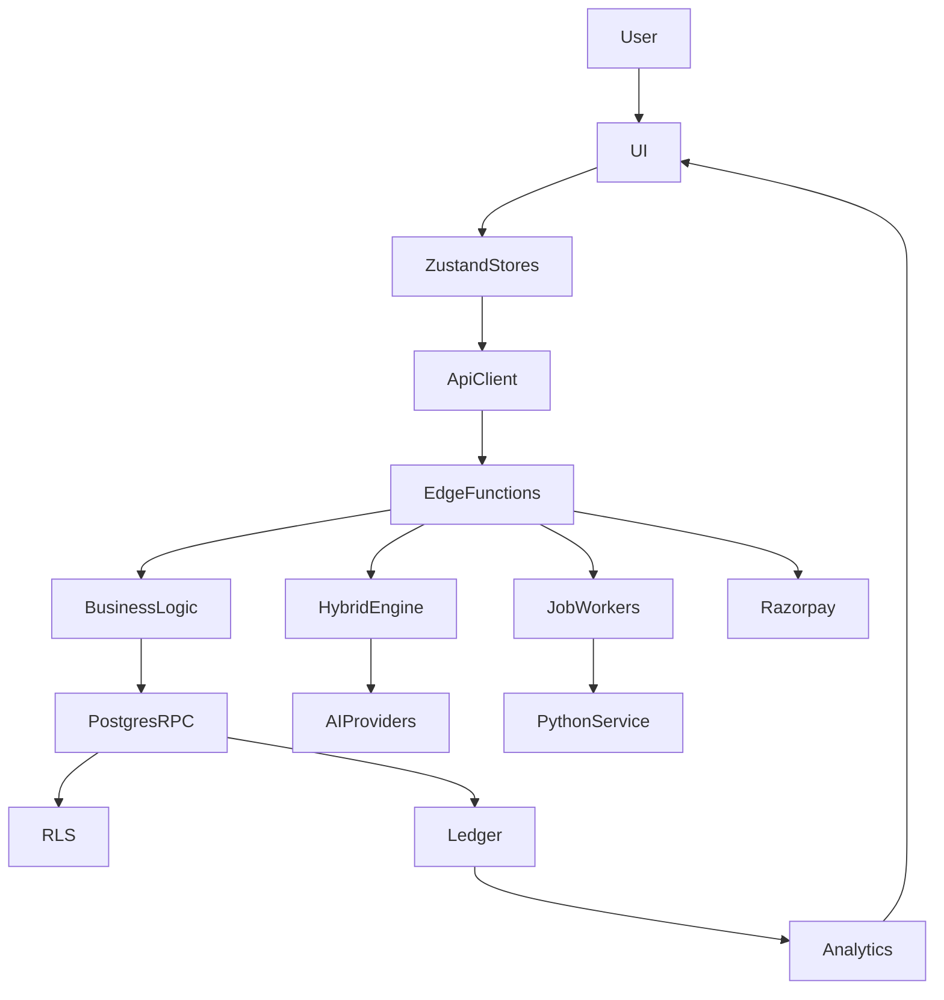

# CAREER PILOT — COMPLETE ENGINEERING & BUSINESS LOGIC AUDIT

**Date:** 2026-09-05 (extended 2026-09-06)  
**Scope:** Full-stack audit (business → UI → state → API → Edge → DB → RLS → AI → Python → credits → billing → auth → security)  
**Product decision (confirmed):** Free tier = **50 credits at signup (one-time)** — no monthly reset job.

> **Canonical audit (2026-09-06):** Release decisions and full §61–§64 coverage live in **[COMPLETE_APPLICATION_AUDIT_2026-09-06.md](./COMPLETE_APPLICATION_AUDIT_2026-09-06.md)**. This file retains the historical fix log and extended matrices from the 2026-09-05/06 cycles.

---

## Executive Summary

Career Pilot is a credit-wallet interview prep platform with **server-authoritative billing** (Postgres RPCs), **Razorpay one-time checkout** (Stripe retired), and **hybrid AI execution** (Gemini → OpenAI → Anthropic → Python → deterministic fallback). The codebase is **mature in contract tests** (~626 unit + hybrid suite) but **runtime verification gaps** remain for live AI audio, gov-exam worker deploy, and Razorpay settlement.

**This audit cycle (2026-09-05):**
- Produced system map + feature matrix (20+ modules)
- Ran automated parity gates (billing catalog v3, hybrid contracts)
- Fixed P0 security: `questions` answer-key exposure via tightened RLS + owned review RPC
- Fixed P0 billing copy: free credits one-time (client + help migration)
- Fixed hybrid test brittleness (error envelope source contract)
- Added regression tests for copy + security migration

**Extended cycle (2026-09-06):**
- Repository-wide discovery index (tech debt markers, localhost, Stripe drift)
- Python dual entry-point routing audit + contract tests
- Gov exam paper **assembly provenance** (Edge + Python aligned metadata, admin UI, migration)
- Official/PYQ fail-closed alignment (Edge `OFFICIAL_MODE_ALLOWED` = `official_verified` only)
- Debrief eligibility fail-closed when `status` is null but session incomplete
- Session duration **runtime contract** (`normalizeSessionDurationInput`)
- Billing UI: one-time purchase copy clarified (not subscription renewal)
- Full matrices: Business Logic, Data Engineering, AI, Python, Billing, Security, Feature Health

**Release classification:** **CONDITIONAL GO**  
Code and unit tests support production logic; **NO-GO** until environment blockers cleared (Edge redeploy, Python worker, live payment webhook, browser E2E on core flows).

---

## Discovery Index (2026-09-06)

| Scan | Count / finding | Top risk |
|------|-----------------|----------|
| TODO/FIXME/HACK/MOCK/FAKE/PLACEHOLDER/LEGACY/DEPRECATED/FALLBACK | ~200+ hits across repo (many in `feature-copies/`, e2e, scripts) | `feature-copies/` drift (RC-H) |
| localhost / 127.0.0.1 | ~120 hits | Mostly e2e, CORS tests, dev config — **production loopback blocked** in `pythonClient.ts` |
| Stripe references | ~80 files | **DEAD/MISLEADING** — fail-closed webhook; `pro_monthly` is Razorpay SKU name not subscription |
| Python `/v1/process` vs `/internal/operations` | 11 V1 ops + 20+ scaffold ops | Guarded: user coach cannot stay on `practice_coach_hint` scaffold |
| Gov dual-assembler | Edge + Python both publish papers | **FIXED** — `assembly_source` column + provenance_json envelope |
| Document SYNC vs ASYNC | Edge job + Python worker | Contract tests pass; live worker NOT_VERIFIED |
| startTime / duration_seconds | Centralized in `sessionDurationContract.ts` | **FIXED** — reject bare numbers at boundary |

---

## Architecture Map

### State ownership

| Domain | Client owner | Server source of truth |
|--------|--------------|------------------------|
| Auth/session | `authStore` (no JWT in Zustand persist) | Supabase Auth + `profiles` |
| Credits balance | `authStore.credits` (cache) | `profiles.credits` + `get_spendable_credits` RPC |
| Live session | `sessionStore` + `overlayStore` | `sessions.lifecycle_status` + RPCs |
| Mock session | `sessionStore` + `answerNextFsm` | `sessions.notes` progress + `session_answers` |
| Coach AI context | `coachStore` + `buildFeatureContext` | Frozen snapshots in session notes |
| Gov exam attempt | Test session UI | `mock_tests` + frozen snapshots |
| Payments | Settings Billing UI | `payment_orders` + Razorpay webhook |

### Credit charging patterns

| Pattern | When | Authority |
|---------|------|-----------|
| A — Client deduct | Mock session upfront | `deduct-credits` Edge → `deduct_credits_service` |
| B — Hybrid inline | Most AI features | `hybridExecute` reserve once, refund on total failure |
| C — Job reserve | Gov paper, debrief, company research | reserve/finalize/release RPCs |

---

## Complete Feature Matrix

| Feature | User Goal | Credits | Plan gate | API/Edge | DB | Status |
|---------|-----------|---------|-----------|----------|-----|--------|
| Signup/Login | Access account | — | — | Supabase Auth | `profiles` | WORKING |
| Email verify | Confirm identity | — | — | Auth + `complete_onboarding` guard | `profiles` | WORKING |
| MFA (TOTP) | Step-up security | — | — | AAL2 + `ProtectedRoute` | `profiles.mfa_*` | WORKING |
| Onboarding | Profile setup | — | — | `complete_onboarding` RPC | `profiles` | WORKING |
| Dashboard | Overview | — | — | Client | multiple | WORKING |
| Practice Coach setup | Configure session | — | Rank 0 | `start-session` | `sessions` | PARTIALLY WORKING |
| Live Copilot | Real-time coaching | 2/8/12 per action | Overlay=Pro | `generate-hint/answer`, `ai-coach-chat` | transcripts, interactions | PARTIALLY WORKING |
| Mock Interview | Simulated interview | 15+ scaled upfront | Rank 0 | `deduct-credits`, `generate-questions` | sessions, answers | WORKING |
| Prep Lab | STAR/rephrase/coding | 2–20 per tool | Rank 0 | `prep-tool`, `polish-star-section` | prep history | WORKING |
| Documents | Resume/JD storage | 8–12 parse | — | `parse-document/resume` | `documents` | WORKING |
| Answer Bank | Store answers | — | — | CRUD | `answer_bank` | WORKING |
| Gov Exams | Exam practice | 3–15 | AI fill=Pro | `create-exam-paper`, worker | gov tables | ENV DEPENDENT |
| Assessments | Template tests | varies | — | `assemble-assessment` | snapshots | PARTIALLY WORKING |
| Scorecard | Session eval | 15 | — | `generate-scorecard` | `scorecards` | WORKING |
| Debrief | Post-session analysis | 15 | — | `generate-debrief` job | debrief jobs | WORKING |
| Referrals | Earn credits | +25/+25 | — | `record-referral` | referrals | WORKING |
| Billing | Buy credits/plan | — | — | Razorpay edges | `payment_orders` | ENV DEPENDENT |
| Calendar | Sync interviews | — | Pro | OAuth callback | calendar tokens | NOT VERIFIED |
| Learning Hub | Courses | — | — | Client | learning tables | INCOMPLETE |
| Community | Q&A forum | — | — | Client | community | WORKING |
| Admin | Ops/finance | — | staff | admin edges | audit logs | PARTIALLY WORKING |
| Electron overlay | Desktop live | same as live | Pro | overlay routes | — | PARTIALLY WORKING |

---

## Cross-Cutting Root Causes

| ID | Root cause | Severity | Status |
|----|------------|----------|--------|
| RC-A | Stripe/Razorpay split-brain (env, legacy edges, naming) | P1 | PARTIAL — Stripe stubs fail closed; Razorpay live |
| RC-B | Duplicate credit APIs (`useCredits` vs `creditsManager`) | P2 | PARTIAL — creditsManager deprecated |
| RC-C | Marketing copy ≠ server (free monthly refresh) | P0 | **FIXED** — one-time 50 signup |
| RC-D | Session FSM fragmentation (4+ layers) | P2 | DOCUMENTED — no illegal transition fixes this cycle |
| RC-E | Code-fixed vs runtime-unverified | P1 | OPEN — needs deploy + browser E2E |
| RC-F | Types lag migrations | P2 | OPEN — regen blocked on remote migrate |
| RC-G | `questions` answer-key exposure | P0 | **FIXED** — RLS + review RPC |
| RC-H | `feature-copies/` drift risk | P3 | DOCUMENTED in docs/feature-copies/README.md |
| RC-I | Gov dual-assembler provenance ambiguity | P1 | **FIXED** — assembly_source + admin UI |
| RC-J | Debrief incomplete session when status=null | P1 | **FIXED** — lifecycle-aware eligibility |
| RC-K | Session duration null/type contract | P2 | **FIXED** — sessionDurationContract |
| RC-L | Official PYQ Edge source policy looser than Python | P1 | **FIXED** — official_verified only |

---

## Findings (selected, full format)

### Finding SEC-001 — Published question answer keys readable via base table

**Category:** Security / RLS  
**Severity:** P0  
**Location:** `questions` RLS policy; `TestResults.tsx`  
**Current:** Authenticated users could SELECT published rows including `correct_answer`.  
**Expected:** Answer keys only after owned completed test or via admin/owner.  
**Root cause:** `questions_select` OR branch allowed public published reads on base table.  
**Fix:** Migration `20260905210000` — owner/admin only on base table; `get_owned_mock_test_question_review` RPC; TestResults uses RPC.  
**Tests:** `src/test/lib/security/questionsReviewRpc.test.ts`  
**Status:** FIXED (pending migration deploy)

### Finding BIZ-001 — Free credits documented as monthly refresh

**Category:** Business logic  
**Severity:** P0  
**Location:** `helpCatalogCopy.ts`, `billing.types.ts`, DB help articles  
**Current:** Copy claimed monthly free refresh; no cron exists.  
**Expected:** One-time 50 at signup per product decision.  
**Root cause:** Legacy Stripe-era copy not updated for Razorpay wallet model.  
**Fix:** Client copy + migration `20260905211000` + CreditBalance UI ("One-time balance").  
**Tests:** `src/test/lib/billing/freeCreditsCopy.test.ts`  
**Status:** FIXED

### Finding BIZ-002 — Free plan session limit marketing mismatch

**Category:** Business logic  
**Severity:** P2  
**Location:** `subscriptionManager.ts` PLANS.free  
**Current:** UI said "2 sessions/month"; server enforces 3/day via `check_free_tier_limits`.  
**Expected:** UI matches server enforcement.  
**Fix:** Updated to "3 sessions/day (server enforced)".  
**Status:** FIXED

### Finding BIL-001 — Stripe split-brain

**Category:** Billing  
**Severity:** P1  
**Location:** `billing.ts`, `stripe-webhook`, env STRIPE_PRICE_*  
**Current:** Stripe checkout throws; webhook never grants; env keys remain.  
**Expected:** Users never see working Stripe paths.  
**Status:** PARTIAL — fail-closed; env cleanup deferred

### Finding AI-001 — Runtime AI personalization unverified

**Category:** AI  
**Severity:** P1  
**Location:** Live Copilot, Mock, Edge functions  
**Current:** Contract tests pass; browser STT+Gemini not verified in CI.  
**Status:** NOT VERIFIED — environment dependent

### Finding OPS-001 — Edge functions not redeployed

**Category:** Deployment  
**Severity:** P1  
**Location:** Supabase Edge  
**Status:** BLOCKED — user/ops action

---

## Domain Summaries

### Authentication / MFA / Multi-tab
- Chain: Auth → verify → MFA (fail-closed TOTP) → ban → billing → onboarding → role → destination
- Multi-tab: shared localStorage JWT; tab-local vs global logout via broadcast
- Tests: `mfaGate.test`, `auth-onboarding.spec`, `auth-account.spec`
- **Status:** WORKING (code); MFA optional until user enrolls (by design)

### Credits / Billing
- Authority: Postgres RPCs > Edge `resolveActionCost` > client preflight
- Catalog: `credit_catalog_v3`, 24 keys, parity scripts pass
- Razorpay: create → pay → verify + webhook → idempotent fulfill
- **Status:** WORKING (code); live webhook NOT VERIFIED

### AI Architecture
- All LLM server-side via `hybridExecute`
- Single charge; refund on total failure
- Context: `buildFeatureContext` + `assertContextForOperation`
- **Status:** WORKING (code); recent context fixes landed 2026-09-05

### Government Exams
- Official/PYQ from verified inventory; AI gap-fill gated Pro
- Credit reserve/finalize on paper jobs
- **Status:** ENVIRONMENT DEPENDENT (worker + migrations)

### RLS / Security
- Broad tenant isolation via `auth.uid()`
- Promo: `get_public_promo_offers` RPC (safe fields); table admin-only
- **Status:** IMPROVED (questions fix); live RLS spot-check needs QA credentials

---

## Test Architecture

| Layer | Coverage | Gap |
|-------|----------|-----|
| Unit (Vitest) | ~626 files | Runtime AI/audio |
| Hybrid contracts | 147+131 tests | Live provider |
| Python contracts | 47 tests | Deployed worker |
| E2E (Playwright) | ~57 specs | Full matrix deferred |
| RLS live | `rls-spot-check.mjs` | Needs SUPABASE_ACCESS_TOKEN |

**Added this cycle:** `freeCreditsCopy.test.ts`, `questionsReviewRpc.test.ts`

---

## Scores (0–10)

| Dimension | Score | Notes |
|-----------|-------|-------|
| Business Logic | 7 | Free credit contradiction fixed |
| Data Engineering | 7 | Strong ledger; session FSM split |
| Database / RLS | 8 | Questions fix; broad RLS |
| Backend / Edge | 8 | Hybrid mature |
| Frontend | 7 | Billing copy aligned |
| API | 8 | Typed errors |
| Authentication | 8 | Fail-closed MFA |
| MFA | 8 | TOTP + recovery |
| Sessions | 7 | Multi-FSM |
| AI | 7 | Context fixed; runtime unverified |
| Personalization | 7 | Contract enforced |
| Credits | 8 | Server authoritative |
| Billing | 7 | Razorpay live; Stripe drift |
| Referrals | 8 | Idempotent RPC |
| Security | 8 | P0 questions fixed |
| Performance | 7 | Some duplicate fetches |
| Scalability | 7 | Job queues for long work |
| Testing | 7 | High unit; low live E2E |
| Observability | 7 | correlation_id in Edge |
| Maintainability | 6 | feature-copies drift risk |
| **Overall** | **7.4** | **CONDITIONAL GO** |

---

## Release Classification

### Per feature (summary)
- **WORKING:** Auth, Mock (code), Prep Lab, Referrals, Answer Bank, Documents (core)
- **PARTIALLY WORKING:** Live Copilot, Assessments, Admin, Electron
- **ENVIRONMENT DEPENDENT:** Gov Exams, Billing settlement, Edge AI keys
- **NOT VERIFIED:** Browser E2E on live audio, Razorpay production webhook
- **INCOMPLETE:** Learning Hub content, Group Practice (retired rooms)

### Final verdict: **CONDITIONAL GO**

**Clear before full GO:**
1. Apply migrations (`20260905210000`, `20260905211000`, pending assessment/referral)
2. Deploy Edge functions (AI + Razorpay)
3. Verify Python worker + gov exam path
4. Live RLS spot-check (User A/B)
5. Browser verification: Live Copilot, Mock voice, Billing test checkout

**NO-GO triggers (none confirmed in code review):**
- Cross-user data leak
- Payment double-grant
- Auth/MFA bypass
- Credit double-charge without idempotency

---

## Fixes Applied (2026-09-05)

| Wave | Item | Files |
|------|------|-------|
| P0 Security | Questions RLS tighten + review RPC | migration, TestResults.tsx |
| P0 Billing | Free credits one-time copy | billing.types, helpCatalogCopy, CreditBalance, subscriptionManager, help migration |
| P2 | Error envelope test brittleness | errorEnvelopes.test.ts |
| P2 | creditsManager deprecation note | creditsManager.ts |
| Tests | Copy + security regression | freeCreditsCopy.test.ts, questionsReviewRpc.test.ts |

---

## Environment Verification Checklist

- [ ] `supabase db push` on target project
- [ ] `supabase functions deploy` (generate-hint, generate-answer, generate-questions, prep-tool, razorpay-*)
- [ ] Python/Render worker health + HMAC
- [ ] Razorpay test webhook → credits granted once
- [ ] Live Gemini + Deepgram session in browser
- [ ] Gov exam: generate → submit → results
- [ ] RLS spot-check with QA users

## Fixes Applied (2026-09-06)

| Wave | Item | Files |
|------|------|-------|
| P1 Gov | Paper assembly provenance metadata | `govPaperAssembly.ts`, `repository.py`, `models.py`, migration `20260906120000` |
| P1 Gov | Official PYQ source policy aligned | `govPaperAssembly.ts` OFFICIAL_MODE_ALLOWED |
| P1 Gov | Admin assembler visibility | `adminOps.ts`, `AdminGovPaperReview.tsx` |
| P1 Debrief | Lifecycle-aware eligibility (status=null) | `debriefEvidence.ts` (Edge + client), `generate-debrief/index.ts` |
| P2 Session | Duration runtime contract | `sessionDurationContract.ts`, `sessionDisplay.ts` |
| P2 Billing | One-time wallet copy | `SettingsBilling.tsx` |
| Tests | Python routing, provenance, session, debrief | `pythonRoutingContracts.test.ts`, `govPaperProvenance.test.ts`, `sessionDurationContract.test.ts` |

---

## Complete Feature Inventory (extended)

| Feature | Route | Owner | API/Edge | DB | AI | Python | Credits | Persistence | Status |
|---------|-------|-------|----------|-----|-----|--------|---------|-------------|--------|
| Signup/Login | `/login`, `/signup` | Auth | Supabase Auth | `profiles` | — | — | — | profiles | WORKING |
| MFA | `/mfa/*` | Auth | AAL2 gate | `profiles.mfa_*` | — | — | — | profiles | WORKING |
| Live Copilot | `/app/live/*` | Session+Overlay | `generate-hint/answer`, `ai-coach-chat` | sessions, transcripts | Gemini→… | speech via `/v1/process` | 2–12/action | session_answers | PARTIALLY_WORKING |
| Mock Interview | `/app/mock/*` | sessionStore | `deduct-credits`, `generate-questions` | sessions, answers | hybrid | validate via `/v1/process` | 15+ upfront | notes+answers | WORKING |
| Prep Lab | `/app/prep/*` | Prep pages | `prep-tool`, `polish-star` | prep history | hybrid | star via `/v1/process` | 2–20 | history rows | WORKING |
| Documents | `/app/library` | Documents | `parse-document`, job worker | documents, jobs | Gemini enrich | `/v1/process` extract | 8–12 | documents | WORKING |
| Gov Exams | `/app/mock-test/*` | Gov UI | `create-exam-paper`, worker | gov_* tables | gap-fill Pro | paper_factory | 3–15 job | papers+attempts | ENV DEPENDENT |
| Assessments | `/app/assessments/*` | Assessment UI | `assemble-assessment` | snapshots | — | — | varies | attempts | PARTIALLY_WORKING |
| Scorecard | session detail | Sessions | `generate-scorecard` | scorecards | hybrid | scaffold | 15 | scorecards | WORKING |
| Debrief | session detail | Sessions | `generate-debrief` job | debrief jobs | hybrid | scaffold | 15 job | debriefs | WORKING |
| Billing | `/settings/billing` | Billing UI | Razorpay edges | payment_orders | — | — | grants | ledger | ENV DEPENDENT |
| Referrals | `/app/referrals` | Referrals | `record-referral` | referrals | — | — | +25/+25 | RPC idempotent | WORKING |
| Admin | `/app/admin/*` | Admin | admin edges | audit logs | — | ingest | — | audit | PARTIALLY_WORKING |

---

## Business Logic Matrix (selected)

| Feature | Rule | Implementation | Correct? | Enforcement | Risk |
|---------|------|----------------|----------|-------------|------|
| Free credits | 50 one-time at signup | RPC grant + copy | Yes | Postgres + Edge | Low |
| Mock upfront charge | Deduct before session | `deduct-credits` | Yes | Edge RPC | Low |
| Hybrid AI | One charge per op | `hybridExecute` reserve/finalize | Yes | Edge | Low |
| Official PYQ | Bank only, no AI fill | Edge+Python validators | Yes (post-fix) | Edge+Python | Low |
| Debrief | No charge without evidence | Eligibility before reserve | Yes | Edge | Low |
| Scorecard | Requires scorable answers | `scorecardEligibility` | Yes | Edge | Med (junk answers) |
| Referrals | No self-referral | RPC guards | Yes | Postgres | Low |

---

## Data Engineering Matrix (selected)

| Entity | Source of Truth | Constraints | RLS | Lifecycle | Risk |
|--------|-----------------|-------------|-----|-----------|------|
| profiles.credits | credit_ledger sum | RPC-only mutation | own row | append-only ledger | Low |
| sessions | sessions table | lifecycle_status RPCs | auth.uid | active→ended | Med (FSM split) |
| gov_generated_papers | gov_generated_papers | paper_source CHECK | admin+owner | review_state FSM | Low (post provenance) |
| payment_orders | payment_orders | idempotency keys | own + service | pending→fulfilled | Low |
| questions | questions | source_type CHECK | owner/admin | publish_status | Low (post RLS fix) |

---

## AI Matrix (selected)

| Feature | Context inputs | Provider chain | Validation | Credit | Status |
|---------|----------------|----------------|------------|--------|--------|
| Live hint | profile, JD, transcript, Q | Gemini→OpenAI→Anthropic | `buildFeatureContext` | hybrid inline | WORKING (code) |
| Mock questions | role, seniority, topics | hybrid + Python validate | schema + validate op | upfront+gen | WORKING |
| Prep tools | STAR/doc context | hybrid | operation registry | hybrid | WORKING |
| Gov gap-fill | syllabus, blueprint | Gemini (Pro gate) | MCQ validator | job reserve | ENV DEPENDENT |
| Debrief | answers+transcript | hybrid AI only | evidence quotes | job reserve | WORKING |

---

## Python Matrix (selected)

| Operation | Entry point | Edge owner | Python role | Credit owner | Status |
|-----------|-------------|------------|-------------|--------------|--------|
| document_extract | `/v1/process` | parse-document | OCR/extract engine | Edge hybrid | WORKING |
| practice_coach | `/v1/process` | generate-hint/answer | coach engine | Edge hybrid | WORKING |
| speech_process | `/v1/process` | live STT post | normalize transcript | Edge hybrid | NOT_VERIFIED live |
| star_evidence | `/v1/process` | prep-tool | evidence extract | Edge hybrid | WORKING |
| mock_question_validate | `/v1/process` | generate-questions | validate MCQ | Edge hybrid | WORKING |
| gov paper factory | Python worker | create-exam-paper job | assemble+publish | job RPC | ENV DEPENDENT |
| session_scorecard | `/internal/operations` | generate-scorecard | deterministic scaffold | Edge hybrid | WORKING |
| session_debrief | `/internal/operations` | generate-debrief | scaffold only (AI on Edge) | job layer | WORKING |

---

## Billing Matrix

| Product | Price source | Provider | Credits | Idempotency | Status |
|---------|--------------|----------|---------|-------------|--------|
| Free | — | — | 50 signup | RPC once | WORKING |
| pro_monthly (SKU) | liveCatalog INR | Razorpay one-time | 1400 grant | webhook+verify | ENV DEPENDENT |
| enterprise_monthly (SKU) | liveCatalog INR | Razorpay one-time | enterprise grant | webhook+verify | ENV DEPENDENT |
| Credit packs | creditEconomics | Razorpay | pack amount | idempotent fulfill | WORKING (code) |
| Stripe legacy | env STRIPE_* | Stripe | **none** | fail-closed | DEAD CODE |

---

## Security Matrix (selected)

| Area | Threat | Protection | Gap | Severity | Fix |
|------|--------|------------|-----|----------|-----|
| Questions | Answer key leak | RLS owner/admin + review RPC | — | — | FIXED |
| Python internal | Replay/forgery | HMAC + timestamp | — | Low | Verified |
| Credits | Client balance tamper | RPC-only deduct | — | Low | OK |
| IDOR sessions | Cross-user access | RLS auth.uid() | Live spot-check pending | Med | Ops verify |
| Promo codes | Secret exposure | public RPC safe fields | — | Low | OK |
| Loopback Python | Prod SSRF to localhost | sanitizeInternalServiceUrl | — | Low | OK |

---

## Feature Health Matrix

| Feature | Business | Frontend | Backend | Data | AI | Security | Performance | Persistence | Overall |
|---------|----------|----------|---------|------|-----|----------|-------------|-------------|---------|
| Auth/MFA | 9 | 8 | 9 | 8 | — | 9 | 8 | 9 | WORKING |
| Live Copilot | 7 | 7 | 8 | 8 | 7* | 8 | 7 | 8 | PARTIAL |
| Mock Interview | 8 | 8 | 8 | 8 | 8 | 8 | 7 | 9 | WORKING |
| Gov Exams | 8 | 7 | 8 | 8 | 7* | 8 | 6 | 8 | ENV DEP |
| Billing | 8 | 8 | 8 | 9 | — | 8 | 8 | 9 | ENV DEP |
| Debrief | 8 | 7 | 8 | 8 | 7* | 8 | 7 | 8 | WORKING |

*Runtime provider/audio not verified in CI

---

## Production Readiness Scores (2026-09-06)

| Dimension | Score | Notes |
|-----------|-------|-------|
| Business Logic | 8 | Gov PYQ + debrief gates aligned |
| Data Engineering | 8 | Provenance column added |
| Database / RLS | 8 | Questions fix; assembly_source migration |
| Backend / Edge | 8 | Hybrid mature |
| Frontend | 7 | Billing copy improved |
| AI | 7 | Context enforced; runtime unverified |
| Python | 8 | Routing contracts; worker deploy pending |
| Auth / MFA | 8 | Fail-closed |
| Security | 8 | P0 questions fixed |
| Credits | 8 | Server authoritative |
| Billing | 7 | Razorpay live; Stripe naming drift |
| Testing | 8 | +pythonRouting, provenance, session contracts |
| Observability | 7 | correlation_id; paper provenance improved |
| **Overall** | **7.8** | **CONDITIONAL GO** |

---

## Final Release Decision

**Verdict: CONDITIONAL GO**

**Cleared in code this cycle:** gov paper provenance, official PYQ policy parity, debrief incomplete-session gate, session duration contract, Python routing contracts.

**Still required for full GO:**
1. Apply migrations (`20260905210000`, `20260905211000`, `20260906120000`)
2. Deploy Edge functions + Python worker
3. Live Razorpay webhook verification
4. Browser E2E: Live Copilot, Mock voice, Gov exam, Billing checkout
5. RLS live spot-check (User A/B)

**NO-GO if found in production:** auth bypass, cross-user leak, credit/payment corruption, core workflow broken.

---

*Canonical audit document. Prior audits: AI_LOGIC_AUDIT_2026-09-05, FEATURE_AUDIT_2026-09-05, CAREER_PILOT_CREDIT_AND_BILLING_RECONCILIATION.*
