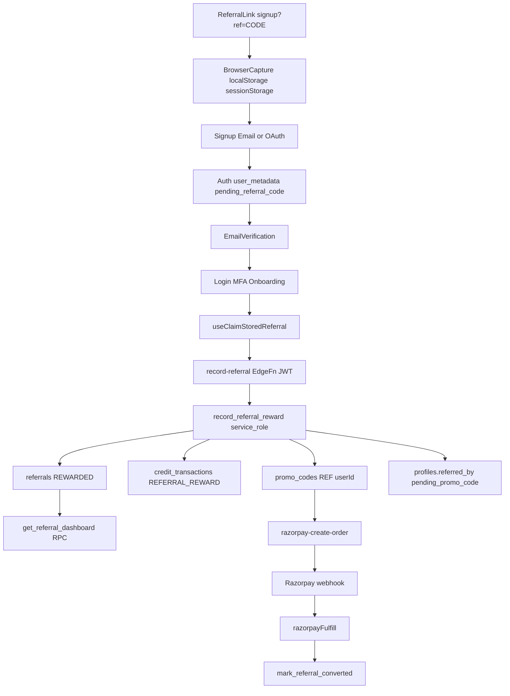

# CAREER PILOT — COMPLETE REFERRAL SYSTEM AUDIT

**Date:** 2026-09-05  
**Programme:** `referral-v1`  
**Scope:** Full lifecycle — link capture → signup → verification → claim → reward → promo → conversion

---

## Referral Architecture

**Authoritative paths:**
- Claim/reward: [`supabase/functions/record-referral/index.ts`](../supabase/functions/record-referral/index.ts) → `record_referral_reward` RPC
- Conversion: [`supabase/functions/_shared/razorpayFulfill.ts`](../supabase/functions/_shared/razorpayFulfill.ts) → `mark_referral_converted`
- Dashboard: `get_referral_dashboard()` RPC
- Admin config: [`src/pages/app/admin/AdminBillingSettings.tsx`](../src/pages/app/admin/AdminBillingSettings.tsx) → `referral_programmes` + `billing_settings`

---

## Referral State Machine

| Status | Meaning | Valid transitions |
|--------|---------|-------------------|
| `signed_up` | Attributed, reward in progress | → `rewarded`, `rejected` |
| `rewarded` | Both credits granted, promo created | → `converted` |
| `converted` | First successful payment (analytics) | terminal |
| `rejected` | Invalid/self/disabled/limit | terminal |
| `pending` | Legacy; UI filter groups with `signed_up` | — |

**Enforced:** `UNIQUE(referred_id)`, idempotency keys on `referral_rewards`, no second credit on conversion (v1).

---

## Component Status (Post-Fix)

| Component | Status | Notes |
|-----------|--------|-------|
| Referral code generation | WORKING | `ensure_my_referral_code()` — stable, collision-safe |
| Link generation | WORKING | `buildReferralLink()` uses `PUBLIC_WEBSITE_URL` |
| `?ref=` / `?r=` capture | WORKING | MarketingLayout, Signup, Login, OAuth |
| Email signup metadata | WORKING | `signUpWithEmail` writes `pending_referral_code` |
| OAuth metadata persistence | WORKING | AuthCallback persists storage/URL → metadata |
| Auto-claim + retry | WORKING | 5 attempts, backoff, email-verified gate |
| Idempotent rewards | WORKING | DB constraints + ledger payment IDs |
| Promo at claim | WORKING | RPC creates single-use REF promo |
| Promo at checkout | WORKING | Full validation on pending_promo path |
| Payment conversion | WORKING | Webhook-only; no second credit |
| Conversion idempotency | WORKING | Early return if `converted_at` set |
| Dashboard / history | WORKING | Server RPC; masked emails |
| Admin config | WORKING | Future claims only; snapshots at claim time |
| Public validation | WORKING | Edge + Signup debounce |
| Observability | WORKING | `record-referral` opsLog with correlation_id, referral_id, reason |
| RLS / isolation | WORKING | No client INSERT on referrals |
| Rate limiting | WORKING | claim 10/min/user; validate 30/min/IP |
| False-success UI | WORKING | Neutral copy until server confirms reward |
| E2E lifecycle | WORKING | `e2e/referral-lifecycle.spec.ts` |
| Refund/chargeback reversal | NOT IMPLEMENTED | v1 policy: no reversal (documented below) |

---

## Issue Register

| # | Issue | Location | Root Cause | Fix | Priority | Status |
|---|-------|----------|------------|-----|----------|--------|
| 1 | OAuth referral lost | OAuthButton, AuthCallback | Metadata not written post-OAuth | `persistPendingReferralToAuthMetadata` in AuthCallback | P0 | FIXED |
| 2 | False-success banners | Signup, Login, Onboarding | UI implied reward before claim | Neutral "saved — applies after verification" copy | P0 | FIXED |
| 3 | Silent claim failure | useClaimStoredReferral | Exhausted retries only logged | Toast on terminal/non-retryable errors | P0 | FIXED |
| 4 | validate window gap | validate-referral-code | Missing start_at/end_at | Align with claim RPC programme window | P1 | FIXED |
| 5 | pending_promo weak checkout | razorpay-create-order | No expiry/redemption checks | Shared promo validation helper | P1 | FIXED |
| 6 | Duplicate conversion events | mark_referral_converted | Event inserted on every webhook retry | Early return if already converted | P1 | FIXED |
| 7 | Login→Signup loses ref in URL | Login.tsx | signupHref omitted ref | Append `?ref=` when code present | P2 | FIXED |
| 8 | Profile stale after claim | useClaimStoredReferral | No loadProfile after success | Force profile refresh on applied | P2 | FIXED |
| 9 | No lifecycle E2E | e2e/ | Dashboard mock only | referral-lifecycle.spec.ts | P2 | FIXED |
| 10 | Refund reversal | razorpay refund path | Not in v1 scope | Documented as intentional v1 behavior | P3 | DOCUMENTED |
| 11 | Admin referral analytics page | — | Not built | Deferred | P3 | DEFERRED |
| 12 | record-referral observability | record-referral/index.ts | No structured success logs | opsLog on RPC success/failure | P3 | FIXED |

---

## Section Summaries (Master Prompt Mapping)

### Referral Code Generation — WORKING
- RPC `ensure_my_referral_code`: 8-char alphanumeric, unique constraint, retry on collision
- Same user always gets same code; refresh does not regenerate

### Link Capture — WORKING
- `extractRefCodeFromSearchParams` supports `?ref=` and legacy `?r=`
- Priority at claim: explicit → metadata → storage
- First valid metadata wins over stale storage-only override

### Signup / Verification / OAuth / MFA / Onboarding — WORKING
- Email: metadata at signup; claim gated on `isUserEmailConfirmed`
- OAuth: storage before redirect + metadata persist in AuthCallback
- Claim runs from ProtectedRoute and onboarding finish (idempotent)

### Claim / Retry / Idempotency — WORKING
- Server-only via Edge + RPC; client never writes referrals/credits
- Retries: 0s, 2s, 5s, 10s, 30s (max 5); no retry on terminal reasons
- Duplicate triggers safe no-op (`already_recorded`)

### Credit Rewards — WORKING
- Referrer + referee via `add_credits` with idempotency keys
- Snapshot: `credits_awarded`, `policy_version`, `programme_id` on referral row

### Promo — WORKING
- Format: `REF` + user id fragment; max_redemptions=1; tied via `pending_promo_code`

### Payment Conversion — WORKING
- `mark_referral_converted` on successful fulfill only
- Failed payment does not convert; second payment does not grant referral credit

### Dashboard — WORKING
- Friends Invited = unique attributed signups
- Credits Earned = referrer ledger rewards only
- Filters: All, Pending, Rewarded, Converted

### Admin — WORKING
- Configurable referrer/referee credits + discount %
- Programme pause rejects new claims; history preserved

### Security / RLS — WORKING
- Cross-user isolation enforced; public validation returns no PII
- Self-referral blocked server-side

### Refund / Chargeback (v1 Policy)
- Refunds do **not** reverse referral signup credits or conversion status
- Chargeback handling not implemented; requires admin review if needed later

---

## Acceptance Criteria Checklist

| # | Criterion | Status |
|---|-----------|--------|
| 1 | Permanent unique referral code | PASS |
| 2 | Correct share link | PASS |
| 3 | `?ref=` and `?r=` captured | PASS |
| 4–9 | Survives signup/verify/OAuth/MFA/onboarding/refresh | PASS |
| 10–14 | Valid claim, invalid fail, self-block, first-code-wins, idempotent | PASS |
| 15–18 | Exact-once rewards, ledger trace, promo once | PASS |
| 19–23 | Promo checkout, conversion, webhook idempotency | PASS |
| 24–29 | Dashboard, filters, RLS, admin config, historical snapshots, pause | PASS |
| 30–34 | Rate limit, fraud basics, privacy, no false-success, multi-tab | PASS |
| 35–36 | Automated tests + E2E lifecycle | PASS |

---

## Test Coverage

| Suite | Path | Result (2026-09-05) |
|-------|------|---------------------|
| Unit | `src/test/lib/referrals.test.ts` | 29/29 pass |
| Unit | `src/test/hooks/useClaimStoredReferral.test.ts` | 3/3 pass |
| E2E | `e2e/referral-lifecycle.spec.ts` | 3/3 pass (Chromium) |
| RLS | `scripts/rls-referral-ab-check.mjs` | Cross-user isolation (see prior evidence) |

**Deploy note:** Apply migration `20260905200000_referral_conversion_event_dedupe.sql` and redeploy edge functions `record-referral`, `validate-referral-code`, `razorpay-create-order` for backend fixes to take effect in production.

---

## Related Documentation

- [`REFERRAL_ATTRIBUTION_POLICY.md`](./REFERRAL_ATTRIBUTION_POLICY.md)
- [`REFERRAL_PROGRAMME_AND_REWARD_CONTRACT.md`](./REFERRAL_PROGRAMME_AND_REWARD_CONTRACT.md)
- [`REFERRAL_MIGRATION_AND_RLS.md`](./REFERRAL_MIGRATION_AND_RLS.md)
